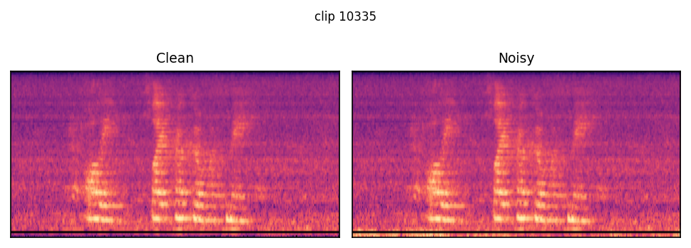
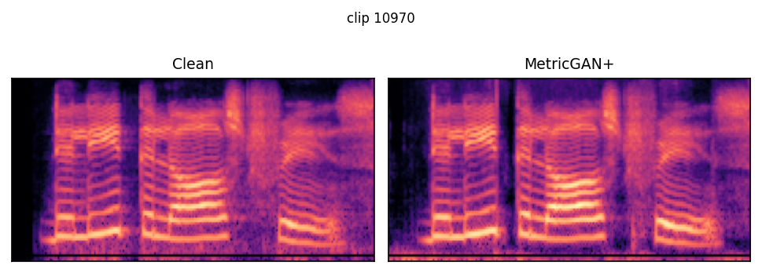
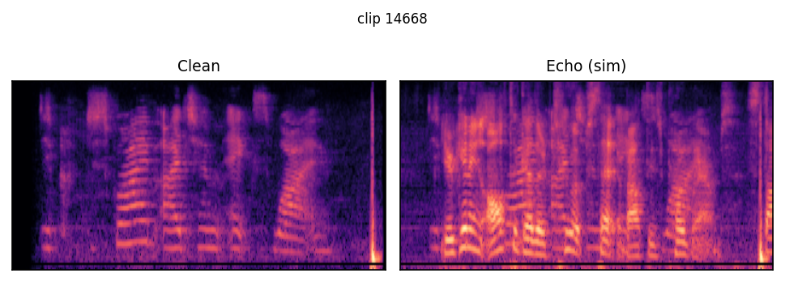
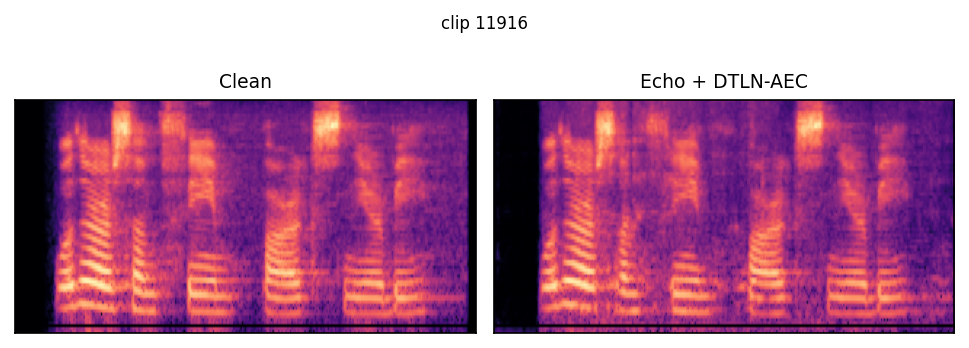
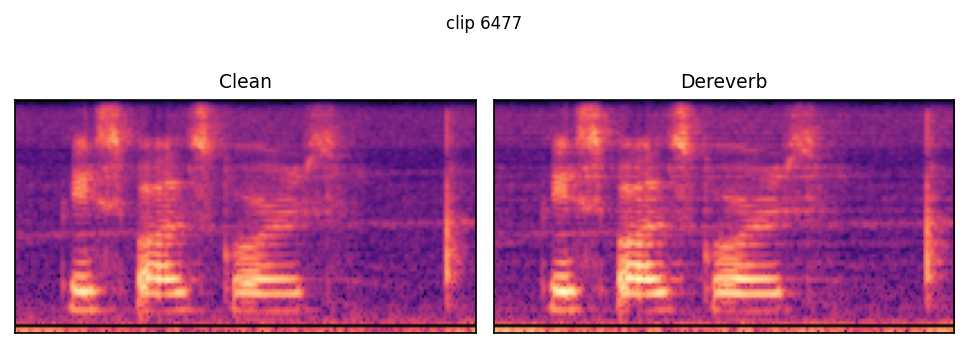

# Perceptually Better, Semantically Worse

Measuring Speech Enhancement Impact on LLM-Based Voice
Systems. Code and evaluation pipeline for the EMNLP 2026
Industry Track paper (accepted).

---

## Overview

Speech enhancement (SE) front-ends improve perceptual quality (PESQ, STOI)
but can silently damage the semantic content that downstream LLMs rely on.
This repository provides the code and evaluation pipeline for measuring
**Output Divergence Rate (ODR)**, the fraction of clips whose LLM-predicted
intent changes after enhancement relative to the clean baseline.

Key findings (5 conditions, 2,974 SLURP test clips, 77 intents):

- MetricGAN+ more than doubles ODR (0.318 vs 0.135) despite improving PESQ.
- Unmitigated echo reaches ODR 0.836 through wrong-speaker transcription.
- PESQ achieves the strongest pooled correlation with ODR (Spearman rho = -0.467),
  but within any single condition no metric exceeds |rho| = 0.34.
- Findings replicate across ASR architectures (Whisper large-v3, wav2vec2-large).

## Qualitative examples

One clip per condition, picked because both ASR pipelines (Whisper large-v3
and wav2vec2-large) independently diverge in predicted intent between the
clean and processed audio. "Clean" transcripts differ slightly between the
two ASR models since each transcribes the same clean audio independently.
"Predicted intent" is the LLM's classification of that transcript over the
77-way SLURP intent set. ODR in each heading is the **condition-level**
Output Divergence Rate (fraction of all ~2,970 clips that diverge, not just
this one) from `results/divergence.csv` (Whisper) and
`results/divergence_wav2vec2.csv` (wav2vec2). A single clip is always
either diverged or not, so ODR itself isn't a per-clip column. Full
clip-level data for all 2,974 clips is in `results/clip_level_divergence.csv`
and `results/transcripts_*.csv`.

Examples are the highest-PESQ diverging clip found per condition, so a few
(Noisy, Dereverb) show almost no visible or audible change. That's
deliberate: it demonstrates the paper's core claim that perceptual quality
does not predict semantic divergence. Echo (sim) and MetricGAN+ show clearer
spectral differences because their diverging clips happen to sit at lower
PESQ. This is not a data bug: for clip `10335`, clean and noisy audio are
measurably different (empirical SNR is about 10.0 dB, matching the design
target, and the two waveforms are not identical), it's just that 10 dB is a
mild degradation and this clip was deliberately chosen for high PESQ despite
diverging.

**WER caveat:** WER here is computed with `jiwer.wer(ref_text, text)` on
Whisper output *without* lowercasing or punctuation stripping, so a
capitalized word or a trailing period is scored as a substitution exactly
like a real transcription error. This means identical WER can hide very
different transcript quality (see MetricGAN+ below, where the clean-audio
WER of 0.50 is entirely capitalization/punctuation, but the condition-audio
WER of 0.50 includes one real error), and conversely a single punctuation
mark can double WER with no change in words (Dereverb: "scores" to "scores."
takes WER from 0.50 to 1.00). wav2vec2's WER is more trustworthy here since
its pipeline lowercases both sides and its CTC output has no punctuation.
Treat Whisper WER values as an upper bound on true transcription error, not
an exact count.

**Original audio:** the unprocessed source recording for any clip number is
at `data/raw/slurp/test/audio/{clip_id}.wav` (identical, byte-for-byte, to
`data/enhanced/clean/{clip_id}.wav`). If you don't have it locally, the same
audio is in the `qmeeus/slurp` dataset on Hugging Face (test split), keyed by
its `slurp_id` field, which is exactly the clip number used throughout this
repo (see `src/data/download_slurp.py`).

#### Noisy - clip `10335` (PESQ = 3.81, condition ODR: Whisper 0.135, wav2vec2 0.352)



Ground-truth transcript: "olly play poker with me"

| ASR | Audio | Transcript | WER | Predicted intent |
|---|---|---|---|---|
| Whisper large-v3 | Clean | "Ollie, flight custom with me." | 0.80 | `general_quirky` |
| Whisper large-v3 | Noisy | "Ollie, Flight Hucka with me." | 0.80 | `transport_query` |
| wav2vec2-large | Clean | "ally flyego with me" | 0.60 | `general_greet` |
| wav2vec2-large | Noisy | "polly fly ego with me" | 0.60 | `play_music` |

#### MetricGAN+ - clip `10970` (PESQ = 3.34, condition ODR: Whisper 0.318, wav2vec2 0.474)



Ground-truth transcript: "delete the last phrase"

| ASR | Audio | Transcript | WER | Predicted intent |
|---|---|---|---|---|
| Whisper large-v3 | Clean | "Delete the last phrase." | 0.50 | `remove` |
| Whisper large-v3 | MetricGAN+ | "Delete the last phase" | 0.50 | `alarm_remove` |
| wav2vec2-large | Clean | "the lead the last phrase" | 0.50 | `general_quirky` |
| wav2vec2-large | MetricGAN+ | "dele the last phrase" | 0.25 | `alarm_remove` |

#### Echo (sim) - clip `14668` (PESQ = 1.75, condition ODR: Whisper 0.836, wav2vec2 0.853)



Ground-truth transcript: "describe item xy"

| ASR | Audio | Transcript | WER | Predicted intent |
|---|---|---|---|---|
| Whisper large-v3 | Clean | "Describe item XY." | 0.67 | `query` |
| Whisper large-v3 | Echo (sim) | "You're getting altogether too upset about these programs." | 2.67 | `general_quirky` |
| wav2vec2-large | Clean | "describe item x i" | 0.67 | `qa_factoid` |
| wav2vec2-large | Echo (sim) | "you're getting altogether too upset about these programmes" | 2.67 | `general_quirky` |

#### Echo + DTLN-AEC - clip `11916` (PESQ = 2.49, condition ODR: Whisper 0.404, wav2vec2 0.587)



Ground-truth transcript: "what are some theme parks nearby"

| ASR | Audio | Transcript | WER | Predicted intent |
|---|---|---|---|---|
| Whisper large-v3 | Clean | "What are some theme parks nearby?" | 0.33 | `locations` |
| Whisper large-v3 | Echo + DTLN-AEC | "What are some theme parks nearby?" | 0.33 | `recommendation_locations` |
| wav2vec2-large | Clean | "woter or some theme parks nearby" | 0.33 | `recommendation_locations` |
| wav2vec2-large | Echo + DTLN-AEC | "wether or some teme park nearby" | 0.67 | `weather_query` |

The two Whisper transcripts here tokenize identically for WER purposes (both
"What are some theme parks nearby?"). The only difference is a leading space
Whisper emitted before the condition-audio transcript (`' What are...'` vs
`'What are...'`), which `_build_user_prompt` passes to the LLM unmodified.
Since the actual words are unchanged, the intent flip here is best read as
LLM output instability (hosted LLMs are rarely bit-exact deterministic
across separate calls even at temperature 0) rather than a case of ODR
catching a real semantic error WER missed.

#### Dereverb - clip `6477` (PESQ = 4.08, condition ODR: Whisper 0.108, wav2vec2 0.320)



Ground-truth transcript: "baseball scores"

| ASR | Audio | Transcript | WER | Predicted intent |
|---|---|---|---|---|
| Whisper large-v3 | Clean | "Baseball scores" | 0.50 | `game` |
| Whisper large-v3 | Dereverb | "Baseball scores." | 1.00 | `qa_factoid` |
| wav2vec2-large | Clean | "peaceball scores" | 0.50 | `game` |
| wav2vec2-large | Dereverb | "peacebal scores" | 0.50 | `qa_stock` |

## Repository structure

```
src/
  enhancement/    # Simulate noise, reverb, echo; apply MetricGAN+, WPE, DTLN-AEC
  asr/            # Whisper and wav2vec2 transcription
  nlp/            # LLM intent classification (OpenAI-compatible API)
  metrics/        # PESQ, STOI, SNR, SI-SDR, SRMR, SQUIM-MOS
  analysis/       # ODR computation, correlations, error taxonomy
  visualization/  # Figures and tables for the paper
scripts/          # Entry-point scripts for each pipeline stage
configs/          # YAML configuration for conditions, metrics
tests/            # Sanity checks for labels, metrics, pipeline integrity
paper/            # LaTeX source, figures, tables
```

## Requirements

Python 3.10+ with CUDA. Install dependencies:

```bash
pip install -r requirements.txt
```

## Running the pipeline

Each stage reads from the previous stage's output and appends results
(idempotent; already-processed clips are skipped).

### 1. Simulate acoustic conditions

```bash
python -m src.enhancement.run_all_conditions
```

Generates `data/enhanced/{condition}/` directories from clean SLURP audio
using DNS Challenge noise and RIR corpora.

### 2. ASR transcription

```bash
python -m src.asr.transcribe_whisper          # Whisper large-v3
python scripts/run_wav2vec2_pipeline.py        # wav2vec2-large (secondary)
```

Outputs `results/transcripts_{condition}.csv`.

### 3. Intent classification

```bash
python -m src.nlp.classify_intent_gpt         # Primary LLM classifier
```

Requires `LLM_API_KEY` and `LLM_MODEL` environment variables (or `.env` file).
Uses any OpenAI-compatible API endpoint. Outputs `results/intents_{model}_{condition}.csv`.

### 4. Divergence and correlation analysis

```bash
python -m src.analysis.compute_divergence     # ODR per condition
python -m src.analysis.compute_correlations   # Metric-ODR correlations
python scripts/compute_extended_correlations.py
python scripts/compute_odr_wav2vec2.py        # wav2vec2 ODR + cross-model comparison
```

### 5. Audio quality metrics

```bash
python -m src.metrics.run_core_metrics        # 6 core metrics (PESQ, STOI, SNR, SI-SDR, SRMR, SQUIM)
```

### 6. Figures and tables

```bash
python -m src.visualization.plot_fig1_odr
python -m src.visualization.plot_fig2_wer_gap
python -m src.visualization.plot_fig3_correlations
python -m src.visualization.generate_tables
```

## Data

The SLURP test set (2,974 clips) and DNS Challenge noise/RIR corpora are
not included due to licensing. Download from:

- **SLURP**: https://github.com/pswietojanski/slurp
- **DNS Challenge**: https://github.com/microsoft/DNS-Challenge

Place files under `data/raw/slurp/test/` and `data/raw/dns/` respectively.

## Conditions

| Condition | Description |
|-----------|-------------|
| Clean | Original SLURP recording (reference) |
| Noisy | DNS noise at SNR = 10 dB |
| MetricGAN+ | GAN-based noise suppression |
| Echo (sim) | Simulated echo, no cancellation |
| Echo + DTLN-AEC | DTLN-AEC echo cancellation |
| Dereverb | WPE dereverberation (5 iterations) |

## Citation

```bibtex
@inproceedings{fela2026perceptually,
  title     = {Perceptually Better, Semantically Worse: Measuring Speech Enhancement Impact on {LLM}-Based Voice Systems},
  author    = {Fela, Randy Frans and Mowlaee, Pejman},
  booktitle = {Proceedings of the 2026 Conference on Empirical Methods in Natural Language Processing: Industry Track},
  year      = {2026},
  publisher = {Association for Computational Linguistics},
  url       = {https://github.com/fransfela/se-llm-odr-benchmark},
}
```

## License

Code released under the MIT License. See [LICENSE](LICENSE).
